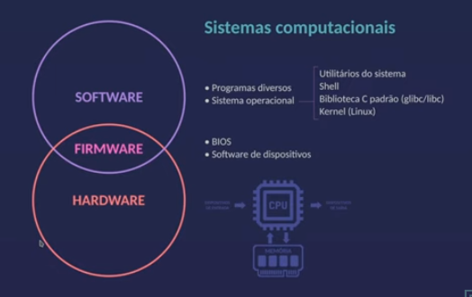
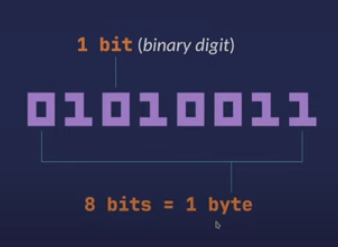
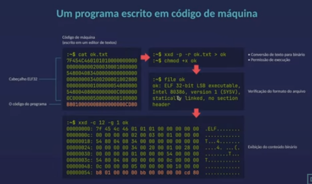
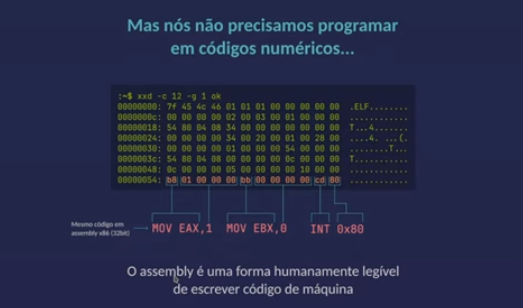
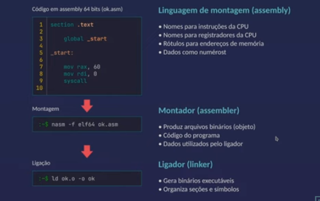

# 42_school_Libasm
The aim of this project is to get familiar with assembly language.

## Assembly Language Fundamentals

<ul>
    <li>Um passo de cada vez</li>
    <li>Não existe o conceito de dados</li>
    <li>Não existem estruturas de decisão e repetição</li>
    <li>Não existem variáveis de parâmetros</li>
</ul>

- O objetivo é manipular dados na memória principal e nos registradores com as instruções da CPU.

### Ferramentas

<ul>
    <li>Editor de textos puros: vim</li>
    <li>Montador (assembler): nasm</li>
    <li>Ligador (linker): GNU ld</li>
    <li>Compilador: GNU gcc</li>
    <li>Makefiles: GNU make</li>
    <li>Depurador: GNU debugger (gdb)</li>
    <li>Editor hexadecimal: hexeditor</li>
    <li>Hex dumper: xxd</li>
</ul>

#### Install

<ul>
    <li>sudo apt get update</li>
    <li>vim: sudo apt install vim -y</li>
    <li>nasm: sudo apt-get -y install nasm</li>
    <li>GNU ld: sudo apt install gcc</li>
    <li>gcc: sudo apt install gcc</li>
    <li>Makefiles: sudo apt install make</li>
    <li></li>
    <li>hexaedit: sudo apt install hexedit</li>
    <li>xxd: sudo apt install xxd</li>
</ul>

## Software Commands

### xxd

- 

### Description

xxd creates a hex dump of a given file or standard input. It can also convert a hex dump back to its original binary form. Like uuencode(1) and uudecode(1) it allows the transmission of binary data in a ‘mail-safe’ ASCII representation, but has the advantage of decoding to standard output.

    <ul>
        <li>xxd -r -p file.txt > file.bin => Transformar arquivo.txt em arquivo.exe </li>
        <li>xxd -p file.txt => Ler arquivo.txt para binario</li>
        <li></li>
        <li></li>
    </ul>

## Introdução ao Hardware

    

        
    

    

        
    

## Dados Binários

#### No processador, tudo é número:

    

              
    

    

        <ul>
            <li>Hexadecimal: 5316</li>
            <li>Octal: 1238</li>
            <li>DEcimal: 8310</li>
            <li>Caractere ASCII: S</li>
        </ul>
    

#### Exemplo de Código

    

              
    

    

              
    

- Cada hexadecimal representa 01 byte (b8, 01, 00, ...)

## Assembly 

    

              
    

### Linguagem de Montagem (Assembly)

<ul>
    <li>Nomes para instruções da CPU</li>
    <li>Nomes para registradores da CPU</li>
    <li>Rótulos para endereços de memória</li>
    <li>Dados como números</li>
</ul>

### Montador (Assembler)

<ul>
    <li>Produz arquivos binários(objeto)</li>
    <li>Código do programa</li>
    <li>Dados utilizados pelo ligador</li>
</ul>

### Ligador (linker)

<ul>
    <li>Gera binários executáveis</li>
    <li>Organiza seções e símbolos</li>
</ul>

